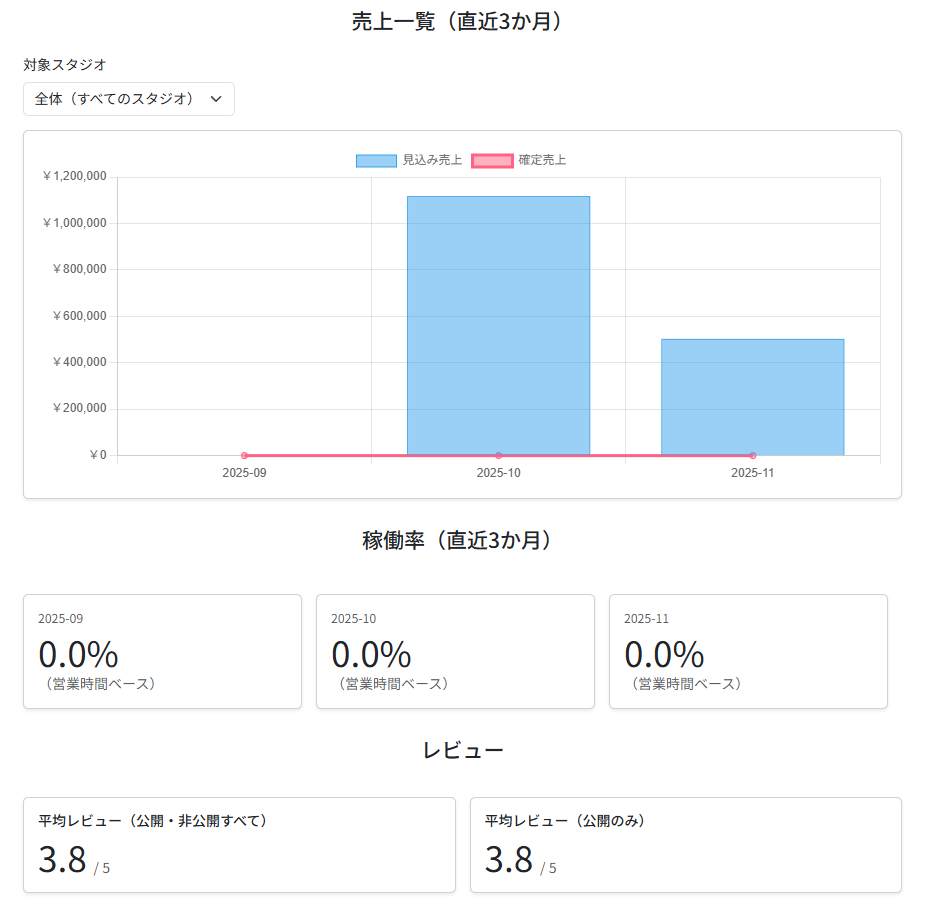
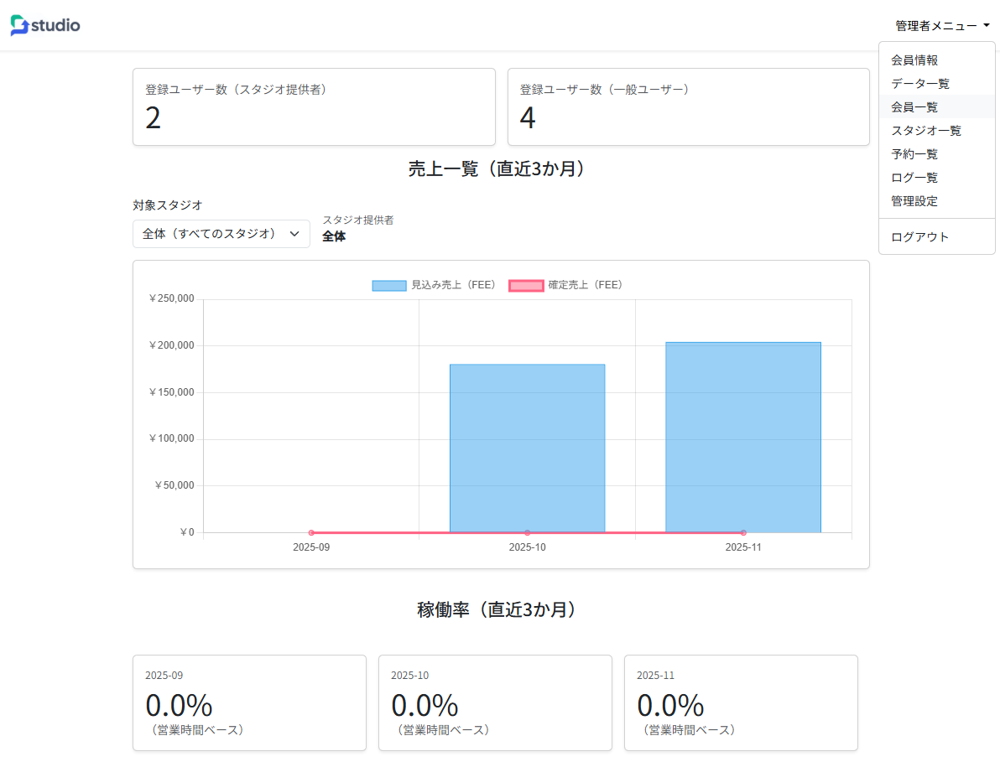
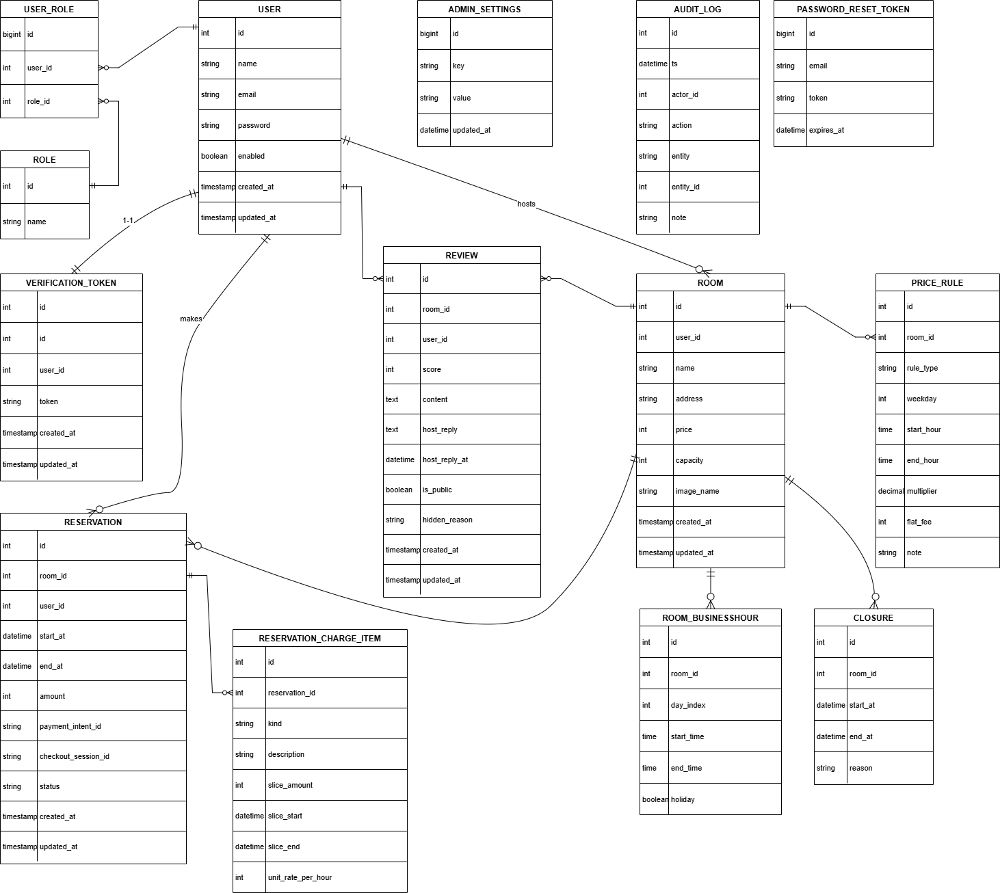

# スタジオ時間貸し予約アプリ（Studio Book）

スタジオ（ダンススタジオ・レンタルスペース等）の**時間貸し予約**を行うための Web アプリケーションです。  
一般ユーザーは検索〜予約〜支払いまでをブラウザ上で完結でき、スタジオ提供者（ホスト）は予約・売上・レビューなどを一元管理できます。  
さらに管理者は全体のスタジオ・ユーザー・売上を統括し、不正利用の監視や設定変更を行います。

> この README は ER 図および各ロール別状態遷移図（一般ユーザー／スタジオ提供者／管理者）を前提とした設計ドキュメントを兼ねています。

---
## 目次

- [スタジオ時間貸し予約アプリ（Studio Book）](#スタジオ時間貸し予約アプリstudio-book)
  - [目次](#目次)
  - [アプリ概要](#アプリ概要)
    - [コンセプト](#コンセプト)
  - [想定ユースケース](#想定ユースケース)
  - [主要機能](#主要機能)
    - [共通](#共通)
    - [一般ユーザー機能](#一般ユーザー機能)
    - [スタジオ提供者（ホスト）機能](#スタジオ提供者ホスト機能)
    - [管理者機能](#管理者機能)
  - [画面イメージ](#画面イメージ)
  - [アーキテクチャ・技術スタック](#アーキテクチャ技術スタック)
    - [使用技術](#使用技術)
  - [ドメインモデルと状態遷移](#ドメインモデルと状態遷移)
    - [ER 図](#er-図)
    - [状態遷移図](#状態遷移図)
  - [ローカル開発環境の構築手順](#ローカル開発環境の構築手順)
    - [前提](#前提)
    - [1. リポジトリのクローン](#1-リポジトリのクローン)
    - [2. DB 作成](#2-db-作成)
    - [3. アプリケーション設定](#3-アプリケーション設定)
    - [4. 初期データ投入](#4-初期データ投入)
    - [5. アプリケーション起動](#5-アプリケーション起動)
    - [6. ロール別ログインアカウント（例）テストアカウント](#6-ロール別ログインアカウント例テストアカウント)
  - [テスト](#テスト)
    - [単体テスト・Web 層テスト](#単体テストweb-層テスト)
  - [ディレクトリ構成（抜粋）](#ディレクトリ構成抜粋)
  - [今後の改善アイデア](#今後の改善アイデア)
  - [ライセンス](#ライセンス)

---

## アプリ概要

- 名称: **スタジオ時間貸し予約アプリ（Studio Book）**
- フレームワーク: Spring Boot
- 言語: Java
- テンプレートエンジン: Thymeleaf
- データベース: MySQL / MariaDB
- 支払い: Stripe 決済連携（カード決済）
- メール: Mailgun などの外部メールサービスを想定（本番環境）

### コンセプト

- **スタジオを持つ個人・法人**が、Web に詳しくなくても簡単に予約受付を開始できる。
- **ユーザーは会員登録後すぐ**にスタジオ検索〜予約〜決済まで完了できる。
- **予約・売上・レビュー・運営者設定**を一つのアプリで完結させる。

---

## 想定ユースケース

- 個人ダンススタジオが、自分のスタジオをオンライン予約対応させたい。
- レンタルスペースオーナーが、複数部屋の予約状況と売上を見える化したい。
- ユーザーが「エリア」「料金」「設備」などでスタジオを検索し、空き枠にすぐ予約したい。
- 管理者が違反スタジオ／ユーザーの停止、システム全体の手数料・税率の調整を行いたい。

---

## 主要機能

### 共通

- 会員登録・ログイン / ログアウト
- パスワードリセット（メールリンク経由）
- プロフィール編集
- 利用規約・プライバシーポリシー画面
- レスポンシブ対応（PC / スマホ）

### 一般ユーザー機能

- スタジオ検索
  - キーワード検索（スタジオ名 / エリア / 住所）
  - 並び替え（料金の安い順・レビュー評価順 など）
- スタジオ詳細ページ
  - 写真ギャラリー
  - 設備情報・料金ルールの説明
  - 営業時間・休館日表示（カレンダー）
  - レビュー表示（平均スコア・コメント）
- 予約機能
  - カレンダーから日時選択（15 分/30 分刻みなど）
  - 営業時間・休館日・既存予約を考慮したバリデーション
  - 時間帯別料金（平日 / 休日、時間帯別ルール）を適用した料金計算
  - Stripe によるクレジットカード決済（事前決済）
- マイページ
  - 予約履歴（未来 / 過去）
  - レビュー投稿・編集・削除

### スタジオ提供者（ホスト）機能

- スタジオ管理
  - スタジオ情報設定
  - 料金ルール管理（平日/休日、時間帯別料金、割増・割引など）
  - 営業時間・休館日（クローズ日）設定（FullCalendar 連携）
- 予約管理
  - 自スタジオの予約一覧・詳細
  - カレンダー表示（予約 / 休館日 / 営業時間）
  - キャンセルポリシーに従ったステータス変更
- 売上・統計
  - 月別売上グラフ（見込み / 確定の比較）
  - スタジオ別売上・稼働率・レビュー平均スコアなど
- レビュー管理
  - レビュー一覧
  - 公開 / 非公開切り替え
  - ホスト返信

### 管理者機能

- スタジオ基本情報登録・編集（名称 / 住所 / 定員 / 設備 / 写真）
- ユーザー管理（一般ユーザー / ホスト / 管理者）
- スタジオ管理（強制停止）
- 予約管理(ホストエラー時の対応用)
- 売上集計（全体）
  - システム手数料・消費税等の計算
- システム設定
  - 税率
  - 管理者手数料率
- 監査ログ
  - 重要操作（ステータス変更 / 設定変更 / アカウント停止など）の記録

---

## 画面イメージ

<div align="center">

<table>
  <!-- 1行目 -->
  <tr>
    <td align="center" width="260" height="40"><strong>トップページ</strong></td>
    <td align="center" width="260" height="40"><strong>スタジオ詳細</strong></td>
    <td align="center" width="260" height="40"><strong>予約カレンダー</strong></td>
  </tr>
  <tr>
    <td align="center">
      
    </td>
    <td align="center">
      
    </td>
    <td align="center">
      
    </td>
  </tr>

  <!-- 2行目 -->
  <tr>
    <td align="center" width="260" height="40"><strong>ホストダッシュボード</strong></td>
    <td align="center" width="260" height="40"><strong>管理者ダッシュボード</strong></td>
    <td align="center" width="260" height="40"><strong>&nbsp;</strong></td>
  </tr>
  <tr>
    <td align="center">
      
    </td>
    <td align="center">
      
    </td>
    <td align="center">
      <!-- 空欄にしておきたい場合 -->
      &nbsp;
    </td>
  </tr>
</table>

</div>


## アーキテクチャ・技術スタック

### 使用技術

- **バックエンド**
  - Java 17
  - Spring Boot 3.x
  - Spring MVC
  - Spring Data JPA
  - Spring Security
- **フロントエンド**
  - Thymeleaf
  - Bootstrap
  - FullCalendar（休館日 / 予約カレンダー表示）
  - Chart.js（ホスト・管理者用統計グラフ）
- **データベース**
  - MySQL / MariaDB
  - Flyway or schema.sql / data.sql による初期データ投入
- **外部サービス**
  - Stripe（決済）
  - Mailgun（メール送信を想定）
- **テスト**
  - JUnit 5
  - Spring Test / MockMvc
  - Mockito
- **その他**
  - Maven or Gradle
  - Heroku / Railway 等へのデプロイを想定

---

## ドメインモデルと状態遷移

### ER 図
図としては以下のようになります。`/docs/ER図.drawio` を参照してください。

  
主なテーブル例（詳細は ER 図を参照）:
- `users`（ユーザー / ロール情報）
- `rooms`（スタジオ情報）
- `business_hours`（曜日別営業時間）
- `closures`（休館日）
- `price_rules`（料金ルール）
- `reservations`（予約ヘッダ）
- `reservation_charge_items`（予約ごとの料金明細）
- `reviews`（レビュー）
- `admin_settings`（税率・手数料など）
- `audit_logs`（監査ログ）

### 状態遷移図

各ロールごとに状態遷移図を用意しています。`/docs/state_diagrams` 配下に配置する想定です。

- `状態遷移図(一般ユーザー).drawio`
  - 例: ゲスト → 会員登録 → ログイン → 予約中 → 決済完了 → 利用済み → レビュー投稿 … の遷移
- `状態遷移図(スタジオ提供者).drawio`
  - 例: スタジオ未登録 → 審査中 → 公開中 → 一時停止 → 削除 など
  - 予約ステータス（未入金 / 入金済み / キャンセル / 返金済み 等）との関係
- `状態遷移図(管理者).drawio`
  - 例: スタジオ申請受付 → 審査 → 承認 / 却下
  - ユーザー凍結 / 解凍
  - システム設定の変更フロー など

README では詳細な図は割愛し、**設計資料として draw.io ファイルを参照できる**ことを明記することで、ポートフォリオとしての説得力を高めています。

---

## ローカル開発環境の構築手順

### 前提

- Java 17 インストール済み
- Maven もしくは Gradle インストール済み（もしくはラッパー使用）
- MySQL / MariaDB インストール済み
- Git インストール済み

### 1. リポジトリのクローン

```bash
git clone https://github.com/your-account/studio-book.git
cd studio-book
```

### 2. DB 作成

MySQL / MariaDB にログインして、開発用データベースを作成します。

```sql
CREATE DATABASE studio_book_dev CHARACTER SET utf8mb4 COLLATE utf8mb4_general_ci;
```

### 3. アプリケーション設定

`src/main/resources/application-example.properties` をコピーして `application.properties` を作成し、環境に合わせて編集します。

```properties
# DB 接続設定
spring.datasource.url=jdbc:mysql://localhost:3306/studio_book_dev?serverTimezone=Asia/Tokyo
spring.datasource.username=your_user
spring.datasource.password=your_password

# JPA
spring.jpa.hibernate.ddl-auto=update
spring.jpa.show-sql=true

# Stripe
stripe.secret-key=sk_test_xxx
stripe.publishable-key=pk_test_xxx
stripe.webhook-secret=whsec_xxx

# メール（必要に応じて）
spring.mail.host=smtp.mailgun.org
spring.mail.port=587
spring.mail.username=postmaster@example.com
spring.mail.password=password
```

### 4. 初期データ投入

以下のいずれかの方法で初期データを投入します。

- `schema.sql` / `data.sql` を利用(利用する際は適時作成してください)
- Flyway などのマイグレーションツール
- 手動で SQL を実行（ポートフォリオ用のダミーデータ）

### 5. アプリケーション起動

```bash
# Maven の場合
./mvnw spring-boot:run

# Gradle の場合
./gradlew bootRun
```

ブラウザで `http://localhost:8080` にアクセスします。

### 6. ロール別ログインアカウント（例）テストアカウント

【テストアカウント】

- ● 管理者  
  - email: `admin1@example.com`  
  - password: `Admin123!`

- ● スタジオ提供者（ホスト）  
  - email: `host1@example.com`  
  - password: `Host123!`

- ● 一般ユーザー  
  - email: `user1@example.com`  
  - password: `User123!`

> 本番環境では、これらのテスト用アカウント情報は必ず変更・無効化し、十分に強度の高いパスワードを個別に設定してください。

---

## テスト

### 単体テスト・Web 層テスト

- コントローラ層: `@WebMvcTest` + `MockMvc` による Web 層テスト
- サービス層: ビジネスロジックの単体テスト
- Stripe Webhook のテスト: シグネチャ検証や異常系パターンのテスト

実行例（Maven の場合）:

```bash
./mvnw test
```

---

## ディレクトリ構成（抜粋）

```text
src
├─ main
│   ├─ java
│   │   └─ com.example.studio_book
│   │       ├─ controller       # コントローラ
│   │       ├─ service          # ビジネスロジック
│   │       ├─ repository       # JPA リポジトリ
│   │       ├─ entity           # エンティティ
│   │       ├─ dto              # DTO
│   │       └─ security         # 認証・認可
│   └─ resources
│       ├─ templates            # Thymeleaf テンプレート
│       ├─ static               # CSS / JS / 画像
│       └─ application.properties
└─ test
    └─ java
        └─ com.example.studio_book
            └─ controller       # Web 層テストなど

docs
├─ ER図.drawio
├─ 状態遷移図(一般ユーザー).drawio
├─ 状態遷移図(スタジオ提供者).drawio
├─ 状態遷移図(管理者).drawio
└─ screenshots
    ├─ top.png
    ├─ room_detail.png
    ├─ calendar.png
    ├─ host_dashboard.png
    └─ admin_dashboard.png
```

---

## 今後の改善アイデア

- クーポン / プロモーションコード機能
- Stripe のサブスクリプションを利用したホスト月額課金
- 予約リマインドメール（前日通知）
- レスポンシブデザインの強化・アクセシビリティ対応
- 多言語対応（日本語 / 英語）
- パフォーマンス改善（キャッシュ、非同期処理の導入）

---

## ライセンス

このアプリケーションは個人ポートフォリオ用途を想定しています。  
企業での利用や再配布を行う場合は、必要に応じてライセンス文やクレジット表記を追加してください。
