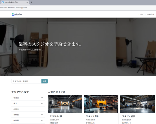
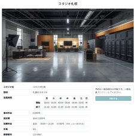
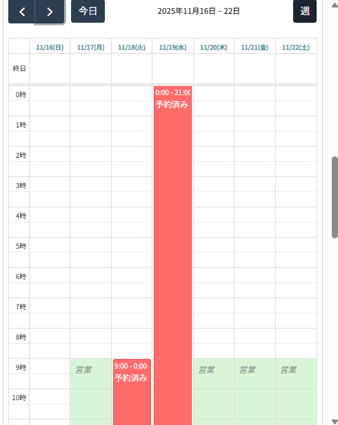
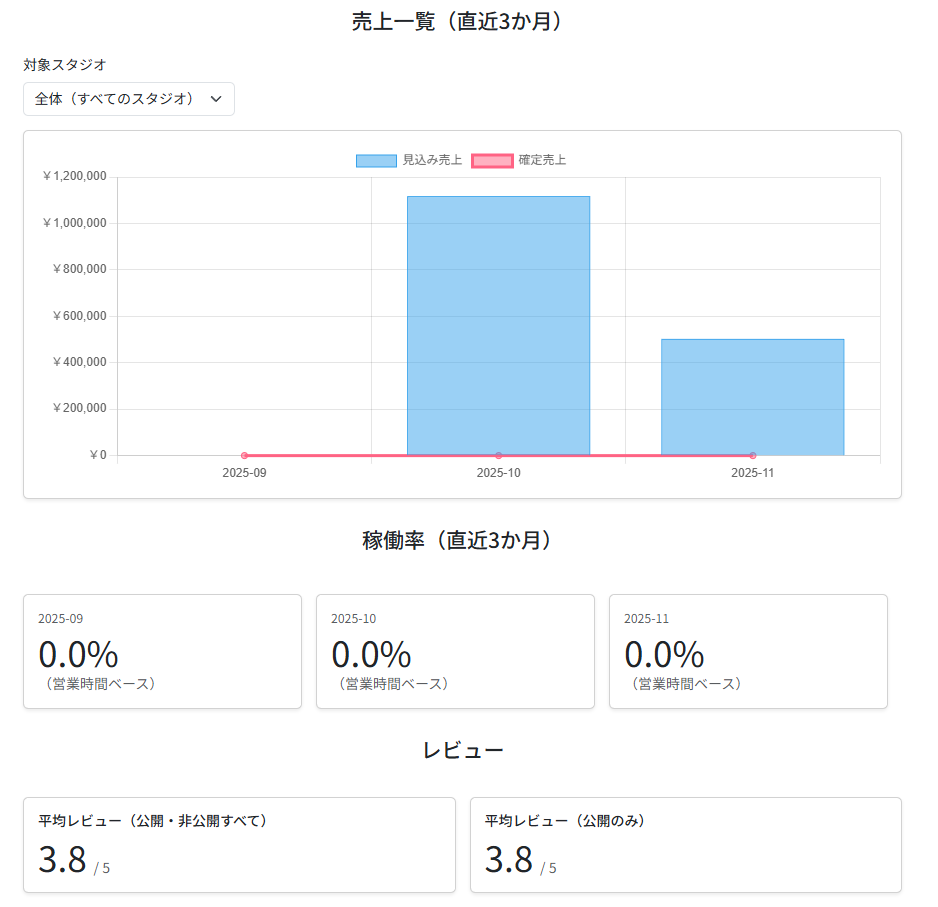
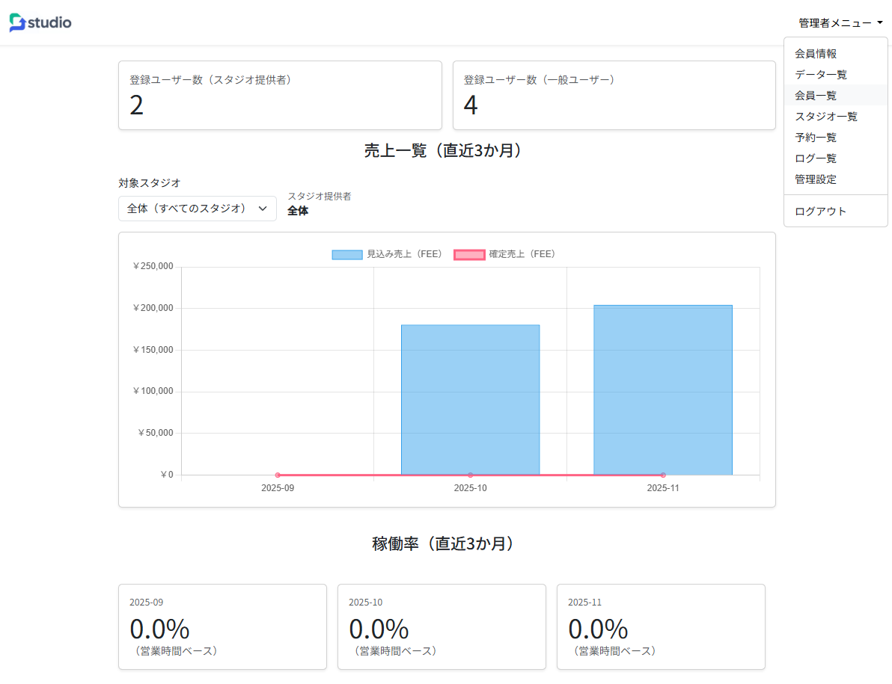
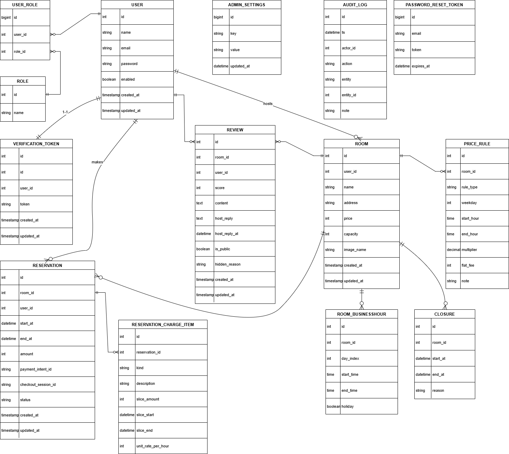
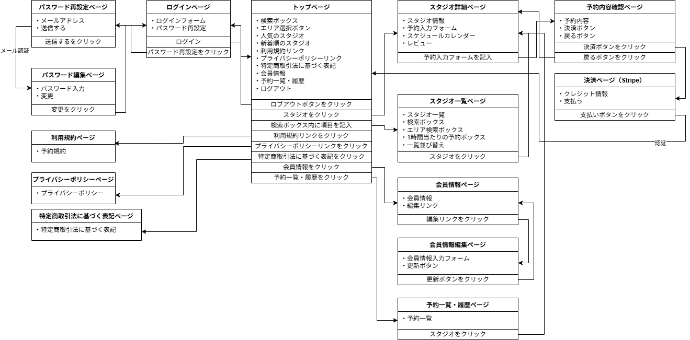
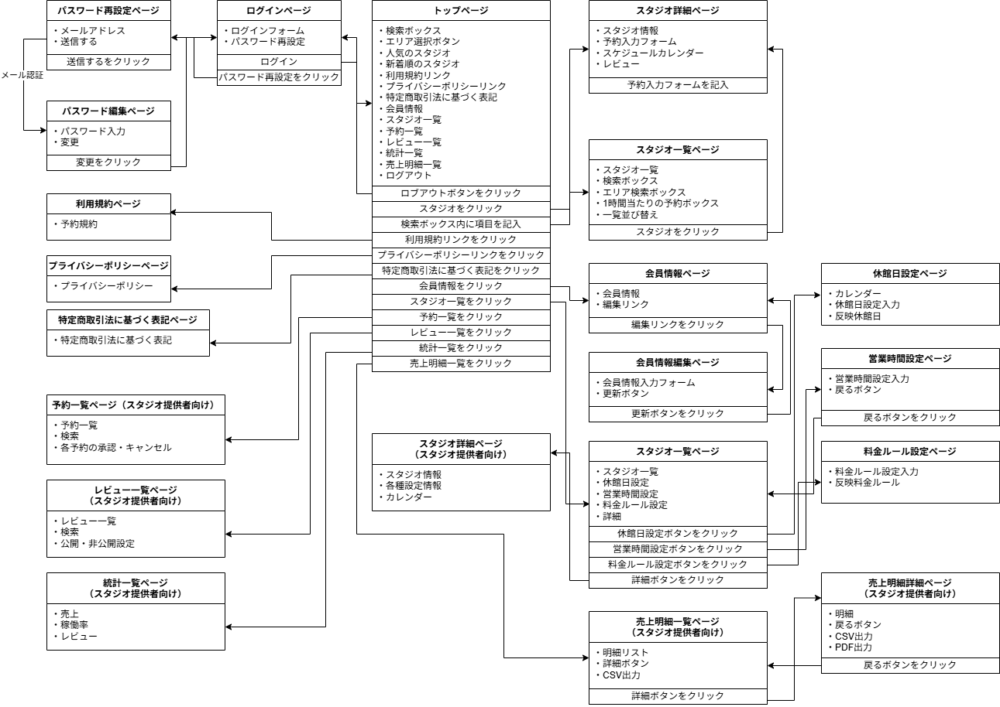
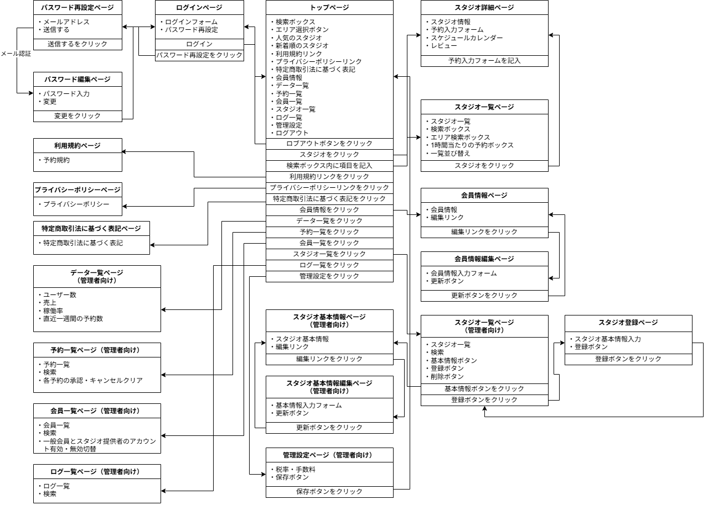

# スタジオ時間貸し予約アプリ（Studio Book）


スタジオ（ダンススタジオ・レンタルスペース等）の**時間貸し予約**を行う Web アプリケーションです。  
一般ユーザーは **検索 → 予約 → 決済** までをブラウザで完結でき、スタジオ提供者（ホスト）は予約・売上・レビューを一元管理できます。  
管理者はスタジオ・ユーザー・売上を統括し、**不正利用の監視**や**システム設定変更**を行います。

---

## ✅ このアプリの概要(3分)

### このアプリで示したいこと
- **3ロール（ユーザー / ホスト / 管理者)** の権限分離と導線設計
- **予約 × 状態遷移**（予約・レビュー・公開/非公開など）の整合性
- **Stripe 決済 + Webhook** による非同期確定フロー（署名検証あり）
- **業務要件っぽい機能**（料金ルール、売上集計、監査ログ）

### 操作導線（Quick Tour）
- **一般ユーザー**：検索 → スタジオ詳細 → カレンダー予約 → **Stripe決済** → 予約履歴  
- **ホスト**：予約一覧 → カレンダー（予約/休館日）→ 売上グラフ → レビュー管理  
- **管理者**：ユーザー/スタジオ管理 → 税率/手数料設定 → **監査ログ確認**
  
※Stripe決済は仮想となります実料金は発生しません。

---

## 🔗 デモサイト
https://studio-book-naoki2025-d9e2f98301ba.herokuapp.com/
- ※ 初回アクセス時は起動に数十秒かかる場合があります（Herokuのスリープ復帰）

## デモ用アカウント
- 管理者：`admin1@example.com` / `Admin123!`
- ホスト：`host1@example.com` / `Host123!`
- 一般ユーザー：`user1@example.com` / `User123!`

---

## 🎯作成背景
このアプリは、スタジオ予約の業務フロー（検索→予約→決済）を、ロール分離と整合性を重視して設計・実装しました。
ユーザー・ホスト・管理者という複数ロールを扱い、**業務で起きるユースケースに耐える設計**（権限分離 / 状態遷移 / 決済連携 / 集計）を意識しています。

> この README は、ER 図およびロール別状態遷移図（一般ユーザー／ホスト／管理者）を前提とした設計ドキュメントも兼ねています。

---

## 🧱 アーキテクチャ概要（SSR + 業務ロジック中心）

詳細な設計方針・アーキテクチャ上の判断については  
[`docs/ARCHITECTURE.md`](docs/ARCHITECTURE.md) にまとめています。

本システムは **Spring Boot を中心**に、Thymeleaf による **サーバーサイドレンダリング（SSR）**で実装しています。  
業務アプリに多い「画面・業務ロジック・DB」を一体で扱い、ロール別の導線/権限制御を整理しやすい構成です。

### 構成（概要）

Browser → Controller → Service → Repository → DB  
＋ Stripe Checkout / Webhook（署名検証）

```text
[Browser]
   |
   v
[Controller (Spring MVC)]  <-----  [Stripe Webhook: POST /stripe/webhook]
   |                                   ^
   v                                   |
[Service (Business Logic)]  ----->  [Stripe API / Checkout]
   |
   v
[Repository (Spring Data JPA)]
   |
   v
[(MySQL/MariaDB)]

```
---
## パッケージ責務
- controller：画面遷移/入力受付、エンドポイント定義（Webhook含む）
- service：業務ルール（予約、料金計算、キャンセル、決済確定、集計）
- repository：永続化（JPA）
- entity：ドメイン状態（予約、料金明細、レビュー等）
- security：認証・認可（ロール別アクセス制御）

---
## 設計上のポイント

- 料金計算：曜日/時間帯/割増等のルールを元に、予約ごとに料金明細（reservation_charge_items）を保持し、業務変更にも耐える形を意識
- 権限制御：ロール（一般/ホスト/管理者）ごとに画面導線と操作範囲を分離（Spring Security）
- 決済整合性：画面遷移結果だけに依存せず、Webhook をトリガーに確定処理する（署名検証あり）

---

## 💳 Stripe 決済・Webhook
Stripe Checkout によるカード決済を実装し、決済完了は Webhook を唯一のトリガーとして処理します。
Webhook では Stripe-Signature による署名検証を行い、正当なイベントのみ受信します。
- Webhook エンドポイント：POST /stripe/webhook
- 実装クラス：StripeWebhookController
- 署名検証：Webhook.constructEvent(payload, sigHeader, webhookSecret)

受信イベント
-  checkout.session.completed：決済完了 → 予約確定処理
-  payment_intent.succeeded
-  charge.succeeded / charge.updated
  
テスト環境では、存在しないメールアドレス等のダミー情報でも決済フローを再現可能です（Stripe Test Mode）。

---

## 決済フロー確認（Stripe Test Mode）

- 一般ユーザーでログイン
- スタジオ詳細 → 日時選択 → 予約 → 決済へ
- Stripe のテストカードで決済
- 決済完了後、Webhook 経由で予約が確定され、予約履歴に反映されます

※（任意）Webhookの重複送信に備え、Event ID / Session ID を用いた冪等制御は今後拡張予定

---

## 🛠 技術スタック

- **Backend:** Java 17, Spring Boot 3, Spring MVC, Spring Security, Spring Data JPA
- **Frontend:** Thymeleaf, Bootstrap, JavaScript
- **DB:** MySQL / MariaDB
- **テスト:** JUnit5, Spring Test（MockMvc）, Mockito
- **外部サービス:** Stripe(決済 + Webhook), Mail（本番想定）
- **デプロイ:** Heroku(デモ)
---

## CI / 品質管理（GitHub Actions）

本リポジトリでは **GitHub Actions による CI（継続的インテグレーション）** を導入し、
push / pull request 時に **ビルドおよびテストを自動実行**しています。

### 実行内容
- Maven ビルドおよびテスト実行  
  - `mvn -B test`
- Java 21 / Maven

### CI 設計方針
本プロジェクトは既存コードベースに対して CI を後付けする想定のため、  
**まずは「常にビルド可能な状態を保つこと」を最優先**としています。

- 外部依存（DB / メール / 決済 API など）を伴わないテストを CI の対象とする
- アプリ全体起動を伴うテスト（`@SpringBootTest`）は現時点では CI 対象外
- 統合テスト・E2E テストは、環境分離や Testcontainers 整備後に段階的に追加予定

### ワークフロー定義
- `.github/workflows/ci.yml`

---
## 目次

  - [想定ユースケース](#想定ユースケース)
  - [主要機能](#主要機能)
    - [共通](#共通)
    - [一般ユーザー機能](#一般ユーザー機能)
    - [スタジオ提供者（ホスト）機能](#スタジオ提供者ホスト機能)
    - [管理者機能](#管理者機能)
  - [画面イメージ](#画面イメージ)
  - [ドメインモデルと状態遷移](#ドメインモデルと状態遷移)
    - [ER 図](#er-図)
    - [状態遷移図](#状態遷移図)
  - [ローカル開発環境の構築手順](#ローカル開発環境の構築手順)
    - [前提](#前提)
    - [1. リポジトリのクローン](#1-リポジトリのクローン)
    - [2. DB 作成](#2-db-作成)
    - [3. アプリケーション設定](#3-アプリケーション設定)
    - [4. 初期データ投入](#4-初期データ投入)
    - [5. アプリケーション起動](#5-アプリケーション起動)
  - [テスト](#テスト)
    - [単体テスト・Web 層テスト](#単体テストweb-層テスト)
  - [ディレクトリ構成（抜粋）](#ディレクトリ構成抜粋)
  - [今後の改善アイデア](#今後の改善アイデア)
  - [ライセンス](#ライセンス)

---

## 想定ユースケース

- 個人ダンススタジオが、オンライン予約を開始したい。
- レンタルスペースオーナーが、複数部屋の予約状況と売上を見える化したい。
- ユーザーがエリア/料金/設備で検索し、空き枠にすぐ予約したい。
- 管理者が違反ユーザー停止、税率・手数料の調整を行いたい。

---

## 主要機能

### 共通

- 会員登録・ログイン / ログアウト
- パスワードリセット（メールリンク経由）
- プロフィール編集
- 利用規約・プライバシーポリシー画面
- レスポンシブ対応（PC / スマホ）

### 一般ユーザー機能

- スタジオ検索（キーワード、並び替え）
- スタジオ詳細ページ（設備、料金ルール、レビュー、カレンダー）
- 予約（営業時間/休館日/既存予約を考慮したバリデーション）
- 料金計算（平日/休日、時間帯別ルール）
- Stripe 決済（事前決済）
- 予約履歴（未来/過去）
- レビュー投稿・編集・削除

### スタジオ提供者（ホスト）機能

- スタジオ管理（基本情報、写真、設備）
- 料金ルール管理（時間帯、割増/割引）
- 営業時間・休館日設定（FullCalendar）
- 予約管理（一覧・詳細、キャンセルポリシーに従った更新）
- 売上・統計（グラフ、稼働率など）
- レビュー管理（公開/非公開、返信）

### 管理者機能

- スタジオ/ユーザー管理（停止含む）
- 予約管理（運営対応用）
- スタジオ管理（強制停止）
- 売上集計（全体）
- システム設定（税率、手数料率）
- 監査ログ（重要操作の記録）

---

## 画面イメージ

<div align="center">

<table>
  <!-- 1行目 -->
  <tr>
    <td align="center" width="260" height="40"><strong>トップページ</strong></td>
    <td align="center" width="260" height="40"><strong>スタジオ詳細</strong></td>
    <td align="center" width="260" height="40"><strong>予約カレンダー</strong></td>
  </tr>
  <tr>
    <td align="center">
      
    </td>
    <td align="center">
      
    </td>
    <td align="center">
      
    </td>
  </tr>

  <!-- 2行目 -->
  <tr>
    <td align="center" width="260" height="40"><strong>ホストダッシュボード</strong></td>
    <td align="center" width="260" height="40"><strong>管理者ダッシュボード</strong></td>
    <td align="center" width="260" height="40"><strong>&nbsp;</strong></td>
  </tr>
  <tr>
    <td align="center">
      
    </td>
    <td align="center">
      
    </td>
    <td align="center">
      <!-- 空欄にしておきたい場合 -->
      &nbsp;
    </td>
  </tr>
</table>

</div>

---

## ドメインモデルと状態遷移

### ER 図
図としては以下のようになります。`/docs/ERD.drawio.png` を参照してください。

  
主なテーブル例（詳細は ER 図を参照）:
- `users`（ユーザー / ロール情報）
- `rooms`（スタジオ情報）
- `business_hours`（曜日別営業時間）
- `closures`（休館日）
- `price_rules`（料金ルール）
- `reservations`（予約ヘッダ）
- `reservation_charge_items`（予約ごとの料金明細）
- `reviews`（レビュー）
- `admin_settings`（税率・手数料など）
- `audit_logs`（監査ログ）

### 状態遷移図

各ロールごとに状態遷移図は以下のようになります。

- 状態遷移図(一般ユーザー)`/docs/state_user.drawio.png`
  
  
- 状態遷移図(スタジオ提供者)`/docs/state_host.drawio.png`
  

- 状態遷移図(管理者)`/docs/state_admin.drawio.png`
  
  
---

## ローカル開発環境の構築手順

### 前提

- Java 17 インストール済み
- Maven もしくは Gradle インストール済み（もしくはラッパー使用）
- MySQL / MariaDB インストール済み
- Git インストール済み

### 1. リポジトリのクローン

```bash
git clone https://github.com/fewioaghwrao/studio_book.git
cd studio_book
```

### 2. DB 作成

```sql
CREATE DATABASE studio_book_dev CHARACTER SET utf8mb4 COLLATE utf8mb4_general_ci;
```

### 3. アプリケーション設定

`src/main/resources/application-example.properties` をコピーして `application.properties` を作成し、環境に合わせて編集します。

```properties
# DB 接続設定
spring.datasource.url=jdbc:mysql://localhost:3306/studio_book_dev?serverTimezone=Asia/Tokyo
spring.datasource.username=your_user
spring.datasource.password=your_password

# JPA
spring.jpa.hibernate.ddl-auto=update
spring.jpa.show-sql=true

# Stripe
stripe.secret-key=sk_test_xxx
stripe.publishable-key=pk_test_xxx
stripe.webhook-secret=whsec_xxx

# メール（必要に応じて）
spring.mail.host=smtp.mailgun.org
spring.mail.port=587
spring.mail.username=postmaster@example.com
spring.mail.password=password
```

### 4. 初期データ投入

本リポジトリでは、DBスキーマは JPA により自動生成されます
（`spring.jpa.hibernate.ddl-auto=update`）。

`schema.sql` / `data.sql` には **最小限の初期データは同梱していません**。
これは、実務を想定し **環境ごとにデータ投入方法が異なるケース**を考慮したためです。

動作確認は以下のいずれかの方法で行います。

- アプリ起動後、画面操作により管理者・ホスト・一般ユーザーを作成
- 開発者が手動で SQL を実行し、必要な最小データを投入

※ 本番運用では Flyway 等のマイグレーションツールによる  
　スキーマ管理・初期データ投入を想定しています。

### 5. アプリケーション起動

初回起動時は DB が空の状態となるため、  
管理者ユーザーを作成してから各ロールの動作確認を行ってください。

```bash
# Maven の場合
./mvnw spring-boot:run
```

ブラウザで `http://localhost:8080` にアクセスします。

---

## テスト

### 単体テスト・Web 層テスト

- コントローラ層: `@WebMvcTest` + `MockMvc` による Web 層テスト
- サービス層: ビジネスロジックの単体テスト
- Stripe Webhook のテスト: シグネチャ検証や異常系パターンのテスト

実行例（Maven の場合）:

```bash
./mvnw test
```

---

## ディレクトリ構成（抜粋）

```text
src
├─ main
│   ├─ java
│   │   └─ com.example.studio_book
│   │       ├─ controller       # コントローラ
│   │       ├─ service          # ビジネスロジック
│   │       ├─ repository       # JPA リポジトリ
│   │       ├─ entity           # エンティティ
│   │       ├─ dto              # DTO
│   │       └─ security         # 認証・認可
│   └─ resources
│       ├─ templates            # Thymeleaf テンプレート
│       ├─ static               # CSS / JS / 画像
│       └─ application.properties
└─ test
    └─ java
        └─ com.example.studio_book
            └─ controller       # Web 層テストなど

docs
├─ ER図.drawio
├─ 状態遷移図(一般ユーザー).drawio
├─ 状態遷移図(スタジオ提供者).drawio
├─ 状態遷移図(管理者).drawio
└─ screenshots
    ├─ top.png
    ├─ room_detail.png
    ├─ calendar.png
    ├─ host_dashboard.png
    └─ admin_dashboard.png
```

---

※ 本リポジトリでは、上記「主要機能」に記載したユーザー／ホスト／管理者向けの機能および予約〜決済までの基本業務フローはすべて実装済みです。  
以下の「今後の改善アイデア」は、実運用を想定した拡張・発展案として整理したものです。

## 今後の改善アイデア
- Webhook 冪等制御（Event ID / Session ID 保持）
- クーポン / プロモーションコード機能
- Stripe のサブスクリプションを利用したホスト月額課金
- 予約リマインドメール（前日通知）
- レスポンシブデザインの強化・アクセシビリティ対応
- 多言語対応（日本語 / 英語）
- キャッシュ、非同期処理の導入
  
---

## ライセンス

このアプリケーションは個人ポートフォリオ用途を想定しています。  
企業での利用や再配布を行う場合は、必要に応じてライセンス文やクレジット表記を追加してください。
